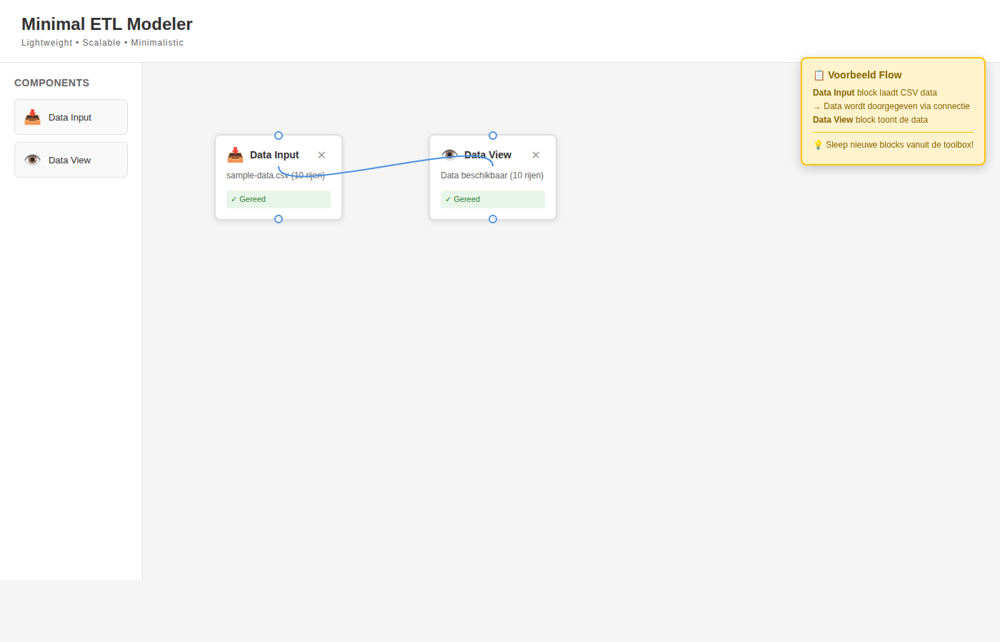

# Minimal ETL Modeler

Een lightweight, schaalbare en minimalistische ETL modeler geïnspireerd op Alteryx Designer, speciaal voor SAP data transformatie.



## ✨ Features

- 📥 **Data Input**: Laad CSV bestanden met SAP data
- 👁️ **Data View Button**: Klik op de Data View button (👁️) in de rechterbovenhoek om data van alle blocks te bekijken
- 👁️ **Inline Data Preview**: Dubbelklik op elk block om data te bekijken (Shift+Dubbelklik voor preview)
- 💾 **Multi-format Export**: Exporteer naar CSV en XLSX met custom filename patterns
- 🚫 **Rejected Output**: Verzamel en exporteer records die validatie falen
- 🤖 **Automapper**: Automatische kolom mapping met smart matching algoritme
- 🔗 **Mapping**: Map kolommen tussen input en output formaten (handmatig of vanuit Automapper)
- ✓ **Validation**: Valideer data met regels en verzamel rejected records
- 📋 **Data Flow Log**: Bekijk een tekstuele representatie van data flow en transformaties
- 🔄 **Individuele Transformatie Blocks**: Visuele transformatie blokken voor betere flow zichtbaarheid
  - ➕ **Concatenate**: Voeg kolommen samen
  - ✂️ **Split**: Split kolommen op delimiter
  - 🔤 **Case Change**: Wijzig hoofdletters
  - 🔢 **Math**: Bereken met getallen
  - 🔍 **Regex Replace**: Vervang tekst patronen
  - 📅 **Date Format**: Formatteer datums
  - 📝 **Expression**: Evalueer expressies
  - 📋 **Copy/Rename**: Kopieer/hernoem kolommen
  - 🔀 **Join**: Voeg twee datasets samen
- ⚙️ **Transform (Legacy)**: Complete transformatie block voor complexe bewerkingen
- 🔗 **Visuele Connecties**: Verbind blokken door ze aan elkaar te koppelen
- 🎯 **Minimalistisch Design**: Geen clutter, alleen de essentials

## 🚀 Quick Start

### Optie 1: Direct in browser (aanbevolen voor lokale bestanden)
1. Open `index.html` in je browser
2. Sleep een **Data Input** block naar het canvas
3. Dubbelklik op het block en laad een CSV bestand (bijv. `examples/sample-data.csv`)
4. Sleep een **Output Data** block naar het canvas
5. Verbind de blocks door te klikken op de output connector (⚪ onderaan) van Data Input en sleep naar de input connector (⚪ bovenaan) van Output Data
6. Dubbelklik op Output Data om te exporteren (CSV of XLSX)
7. **TIP**: Gebruik Shift+Dubbelklik op elk block om data te previewen!

### Optie 2: Met lokale server (voor geavanceerde features)
Voor optimale werking, vooral wanneer je externe CSV bestanden wilt laden via URL, gebruik een lokale webserver:

```bash
# Met Python 3
python3 -m http.server 8000

# Of met Node.js (npx)
npx http-server -p 8000
```

Open vervolgens: `http://localhost:8000`

> **Note**: De applicatie gebruikt FileReader API voor lokale bestanden, wat werkt zonder server. Een lokale server is alleen nodig als je externe CSV bestanden wilt laden via fetch() of als je browser strikte CORS-restricties heeft.

## 📁 Project Structuur

```
minimal-etl-modeler/
├── index.html           # 🎯 START HIER - Open dit bestand om de applicatie te starten
├── app.js               # Core applicatie logica
├── style.css            # Styling
├── README.md            # Deze file
├── examples/            # Sample data en voorbeeld flows
│   ├── sample-data.csv
│   ├── sample-template.csv
│   ├── large-test-data.csv
│   ├── example-etl-flow.json
│   ├── demo.html
│   └── example-flow.html
├── output/              # 📤 Sla hier je geëxporteerde bestanden op
├── docs/                # Documentatie en handleidingen
│   ├── QUICKSTART.md
│   ├── GEBRUIKERSHANDLEIDING.md
│   ├── ARCHITECTURE.md
│   └── ... (meer guides)
├── tests/               # Test files en test data
│   ├── test-*.js
│   └── test-*.csv
└── assets/              # Screenshots en afbeeldingen
    └── screenshot-*.png
```

## 🎨 Design Filosofie

- **Lightweight**: Geen externe dependencies (behalve SheetJS CDN voor XLSX export), pure vanilla JavaScript
- **Scalable**: Modulaire architectuur voor toekomstige uitbreidingen
- **Minimalistic**: Clean interface met alleen de noodzakelijke features
- **0 Clutter**: Focus op functionaliteit zonder afleidingen

## 🔧 Gebruik

### Data Input Block
- Ondersteunt CSV bestanden
- Automatische parsing van headers
- Toont aantal rijen en kolommen
- **Dubbelklik**: Upload bestand of preview data (als al geladen)
- **Shift+Dubbelklik**: Preview data direct

### Inline Data Preview ✨ NIEUW
- **Alle blocks** ondersteunen nu data preview
- **Shift+Dubbelklik** op elk block om output data te bekijken
- Preview toont eerste 100 rijen voor snelle controle
- Werkt voor alle transformatie blocks, validation, joins, etc.

### Data View Block 👁️ NIEUW
- **Dedicated viewing component** om data te inspecteren op elk punt in je ETL flow
- **Pass-through functionaliteit**: Data wordt ongewijzigd doorgegeven aan volgende blocks
- **Full data preview**: Bekijk alle kolommen en eerste 100 rijen in een scrollbare tabel
- **Data overview**: Zie het aantal rijen en kolommen in één oogopslag
- **Gebruik**: Sleep naar canvas, verbind met een data block, dubbelklik om te openen
- **Perfect voor debugging**: Controleer data tussen transformatie stappen
- **Geen impact op performance**: Gebruikt dezelfde optimalisaties als andere blocks

### Output Data Block
- Export data naar **CSV** of **XLSX** formaat
- Custom filename patterns met datum tokens:
  - `YYYYMMDD`: bijv. "20240315"
  - `YYYY-MM-DD`: bijv. "2024-03-15"
  - `YYYYMMDD_HHMMSS`: bijv. "20240315_143052"
  - Gebruik `#` als separator: `S_AUFK#YYYYMMDD` → `S_AUFK20240315.csv`
- Preview van data voor export
- Toont kolommen en eerste 3 rijen

### Rejected Output Block 🚫 NIEUW
- Verzamelt automatisch alle rejected records van validation blocks
- Export rejected data naar CSV of XLSX
- Inclusief `__validation_errors__` kolom met error details
- Custom filename patterns (bijv. `rejected#YYYYMMDD`)
- Bekijk aantal rejected records per validation
- Perfect voor data quality monitoring en error analysis

### Automapper Block
- Automatische kolom mapping tussen input en output templates
- Smart matching algoritme met 3 niveaus:
  - **Exact match**: Identieke kolomnamen (na normalisatie)
  - **Partial match**: Gedeeltelijke overeenkomst (bijv. "Material" ↔ "MaterialNumber")
  - **Fuzzy match**: Vergelijkbare kolomnamen op basis van karakterovereenkomst
- Visuele confidence indicators per mapping
- Preview van voorgestelde mappings met highlighting van niet-gematchte kolommen
- Twee actiemogelijkheden:
  - **Apply Auto-Mappings**: Direct toepassen voor snelle transformatie
  - **Send to Mapping Block**: Overdragen naar Mapping block voor handmatige aanpassingen
- Normalisatie: automatisch lowercase, verwijderen van underscores/spaties/hyphens

### Mapping Block
- Handmatige kolom mapping
- Kan mappings ontvangen van Automapper block
- Ondersteunt zowel template-based als free-form mapping
- Toepassen van mapping transformaties

### Transformatie Blocks ✨ NIEUW
Individuele blocks voor elk transformatie type - verbeter de visuele duidelijkheid van je data flow:

- **➕ Concatenate**: Voeg meerdere kolommen samen met een scheidingsteken
- **✂️ Split**: Split een kolom op een delimiter en extraheer een specifiek deel
- **🔤 Case Change**: Wijzig tekstkapitalisatie (UPPERCASE, lowercase, Capitalize)
- **🔢 Math**: Voer mathematische bewerkingen uit (optellen, aftrekken, vermenigvuldigen, delen)
- **🔍 Regex Replace**: Zoek en vervang tekst met reguliere expressies
- **📅 Date Format**: Parse en herformatteer datums
- **📝 Expression**: Evalueer expressies met kolom waarde substitutie
- **📋 Copy/Rename**: Kopieer of hernoem kolommen
- **🔀 Join**: Voeg twee datasets samen op basis van matching sleutels

Zie [SPLIT-TRANSFORM-BLOCKS-GUIDE.md](SPLIT-TRANSFORM-BLOCKS-GUIDE.md) voor uitgebreide documentatie.

### Join Block ✨ NIEUW
- Voeg twee datasets samen op basis van matching kolommen
- Ondersteunt 4 join types:
  - **Inner Join**: Alleen matching records
  - **Left Join**: Alle records uit linker dataset + matches
  - **Right Join**: Alle records uit rechter dataset + matches  
  - **Full Outer Join**: Alle records uit beide datasets
- Vereist twee input connecties
- Automatische conflict resolutie voor kolommen met dezelfde naam
- Visuele preview van beide datasets voor de join

### Validation Block
- Configureer validatie regels voor kolommen
- Ondersteunt: required, type checks, regex, min/max waarden
- Toont aantal valid en invalid records
- **Rejected records worden automatisch verzameld** ✨ NIEUW
- Gebruik met Rejected Output block voor error analysis

### Connecties
- Sleep van output (onderste connector) naar input (bovenste connector)
- Data wordt automatisch doorgegeven via connecties
- Visuele curved lines tonen data flow

## 🧪 Tests

Het project bevat uitgebreide tests voor alle functionaliteiten. Alle tests bevinden zich in de `tests/` directory:

```bash
node tests/test-mapping.js                   # Test mapping functionaliteit (9 tests)
node tests/test-automapper.js                # Test automapper functionaliteit (12 tests)
node tests/test-automapper-integration.js    # Test complete data flow (10 tests)
node tests/test-advanced-transform.js        # Test transformatie operaties (20 tests)
node tests/test-split-transform-blocks.js    # Test individuele transformatie blocks (12 tests)
node tests/test-join.js                      # Test join functionaliteit (10 tests)
node tests/test-validation.js                # Test validation functionaliteit (13 tests)
node tests/test-export-features.js           # Test export en rejected output (16 tests)
node tests/test-dataview.js                  # Test data view component (10 tests) 👁️ NIEUW
```

## 🔄 Aanbevolen Workflows

**Met Data View voor pipeline debugging:** 👁️ NIEUW
1. Data Input → Laad bron CSV
2. Data View → Bekijk ruwe input data
3. Transform/Split/Concatenate → Pas transformaties toe
4. Data View → Controleer getransformeerde data
5. Validation → Valideer data
6. Data View → Bekijk finale data voor export
7. Output Data → Exporteer resultaat

**Met data quality en rejected output:**
1. Data Input → Laad bron CSV
2. Validation → Configureer validatie regels
3. Output Data → Exporteer valid records naar XLSX met custom filename
4. Rejected Output → Exporteer rejected records voor analyse
5. **Tip**: Gebruik Shift+Dubbelklik op elk block om data te inspecteren

**Met Join block voor dataset combinatie:**
1. Data Input 1 → Laad eerste dataset (bijv. employees.csv)
2. Data Input 2 → Laad tweede dataset (bijv. departments.csv)
3. Join → Verbind beide inputs, selecteer join type en keys
4. Data View → Controleer gecombineerde data 👁️ NIEUW
5. Output Data → Exporteer gecombineerde dataset als XLSX

**Met visuele transformatie blocks:**
1. Data Input → Laad bron CSV
2. Concatenate → Voeg kolommen samen (bijv. voornaam + achternaam)
3. Split → Extraheer domein uit email
4. Case Change → Normaliseer tekst
5. Math → Bereken totalen
6. **Data View** op elk punt om data te inspecteren 👁️ NIEUW
7. Output Data → Exporteer resultaat als XLSX met custom filename

**Snelle mapping met Automapper:**
1. Data Input → Laad bron CSV
2. Target Structure → Laad template CSV
3. Automapper → Verbind met beide, genereer mappings
4. Optie A: Apply direct voor snelle transformatie
5. Optie B: Send to Mapping → handmatige aanpassingen → Transform
6. Output Data → Exporteer resultaat

**Handmatige mapping:**
1. Data Input → Laad bron CSV
2. Mapping → Handmatig kolommen mappen
3. Transform (Legacy) → Transformeer en exporteer
4. Output Data → Exporteer resultaat
## ⚡ Performance

### Optimalisaties voor Grote Datasets (NIEUW ✨)
De applicatie is geoptimaliseerd voor datasets met **10,000+ rijen**:

- **Automatische optimalisaties**: Vanaf 1,000 rijen worden performance optimalisaties automatisch geactiveerd
- **Efficiënte DOM rendering**: DocumentFragment gebruikt voor snellere tabel weergave bij grote datasets
- **Geoptimaliseerd data klonen**: Shallow copying voor grote datasets (10k+ rijen) om geheugen te besparen
- **Performance monitoring**: Automatische waarschuwingen bij langzame operaties (>1 seconde)
- **Visuele indicatoren**: 🚀 icoon toont wanneer optimalisaties actief zijn
- **Slimme CSV parsing**: Geoptimaliseerde parsing voor bestanden >5MB

### Geteste Performance
- **1,000 rijen**: < 15ms totale verwerkingstijd
- **5,000 rijen**: < 35ms totale verwerkingstijd  
- **10,000 rijen**: < 50ms totale verwerkingstijd
- **15,000 rijen**: < 60ms totale verwerkingstijd

### Aanbevolen Dataset Groottes
- **Optimaal**: 1,000 - 15,000 rijen, < 50 kolommen
- **Goed**: 15,000 - 30,000 rijen, < 100 kolommen
- **Maximum**: 50,000 rijen, < 100 kolommen
- **File grootte**: Tot 50 MB ondersteund

### Performance Tips
- Data View toont automatisch eerste 100 rijen voor snelheid
- Performance optimalisaties worden automatisch geactiveerd vanaf 1,000 rijen
- Gebruik de browser console (F12) om performance metrieken te zien
- Bij >30,000 rijen: overweeg data te filteren voor specifieke bewerkingen

## 🔒 Beveiliging & Privacy

### Data Privacy
- ✅ Alle data blijft lokaal in je browser
- ✅ Geen data wordt naar externe servers gestuurd
- ✅ Geen tracking of analytics
- ✅ Data wordt gewist bij page refresh

### Veilig Gebruik
- Valideer altijd je CSV bestanden voor gebruik
- Check output data voor correctheid
- XSS bescherming ingebouwd voor data display

## 📚 Documentatie

Alle documentatie is beschikbaar in de `docs/` directory:

- **[Quick Start](docs/QUICKSTART.md)** - Snelle start gids
- **[User Guide](docs/GEBRUIKERSHANDLEIDING.md)** - Uitgebreide gebruikershandleiding
- **[Architecture](docs/ARCHITECTURE.md)** - Technische architectuur en design patterns
- **[CSV Format Guide](docs/CSV-GUIDE.md)** - CSV bestand vereisten en best practices
- **[Logging Guide](docs/LOGGING-GUIDE.md)** - Data Flow Log functionaliteit en gebruik
- **[Transform Guide](docs/TRANSFORM-GUIDE.md)** - Transformatie blocks handleiding
- **[Performance](docs/PERFORMANCE-OPTIMIZATIONS.md)** - Performance optimalisaties

## 🐛 Bekende Beperkingen

- Escaped quotes binnen CSV waarden (bijv. `"value with ""quotes"""`) nog niet ondersteund
- Newlines binnen quoted CSV waarden niet ondersteund
- Maximum bestandsgrootte afhankelijk van browser geheugen
- Canvas kan onoverzichtelijk worden met >50 blocks

**Let op:** Basis quoted values met commas worden WEL ondersteund (bijv. `"value, with comma"`)

