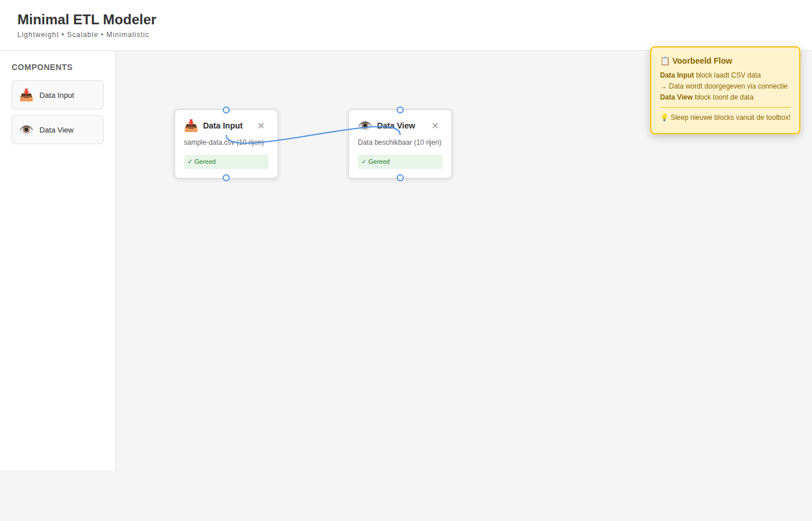

# Minimal ETL Modeler

Een lightweight, schaalbare en minimalistische ETL modeler geïnspireerd op Alteryx Designer, speciaal voor SAP data transformatie.



## ✨ Features

- 📥 **Data Input**: Laad CSV bestanden met SAP data
- 👁️ **Data View**: Bekijk en verifieer je data
- 🔗 **Mapping**: Map kolommen tussen input en output formaten
- ⚙️ **Transform**: Transformeer data en exporteer naar CSV
- 🔗 **Visuele Connecties**: Verbind blokken door ze aan elkaar te koppelen
- 🎯 **Minimalistisch Design**: Geen clutter, alleen de essentials

## 🚀 Quick Start

1. Open `index.html` in je browser
2. Sleep een **Data Input** block naar het canvas
3. Dubbelklik op het block en laad een CSV bestand (bijv. `sample-data.csv`)
4. Sleep een **Data View** block naar het canvas
5. Verbind de blocks door te klikken op de output connector (⚪ onderaan) van Data Input en sleep naar de input connector (⚪ bovenaan) van Data View
6. Dubbelklik op Data View om de data te bekijken

## 📁 Project Structuur

```
minimal-etl-modeler/
├── index.html                    # Hoofd HTML bestand
├── style.css                     # Minimalistisch styling
├── app.js                        # Core functionaliteit
├── sample-data.csv               # Voorbeeld SAP data
├── README.md                     # Deze file
├── QUICKSTART.md                 # Snelle start gids
├── GEBRUIKERSHANDLEIDING.md      # Uitgebreide handleiding
├── ARCHITECTURE.md               # Technische architectuur
└── demo.html                     # Demo pagina
```

## 🎨 Design Filosofie

- **Lightweight**: Geen externe dependencies, pure vanilla JavaScript
- **Scalable**: Modulaire architectuur voor toekomstige uitbreidingen
- **Minimalistic**: Clean interface met alleen de noodzakelijke features
- **0 Clutter**: Focus op functionaliteit zonder afleidingen

## 🔧 Gebruik

### Data Input Block
- Ondersteunt CSV bestanden
- Automatische parsing van headers
- Toont aantal rijen en kolommen

### Data View Block
- Tabelweergave van data
- Sticky headers voor gemakkelijk scrollen
- Limiet van 100 rijen voor performance

### Transform Block
- Map input kolommen naar output kolommen
- Transformeer data volgens mapping regels
- Exporteer getransformeerde data als CSV
- Download functionaliteit voor output bestanden

### Connecties
- Sleep van output (onderste connector) naar input (bovenste connector)
- Data wordt automatisch doorgegeven via connecties
- Visuele curved lines tonen data flow

## 📝 Toekomstige Uitbreidingen

- Meer transformatie opties (filters, aggregaties)
- Save/Load ETL flows
- Real-time data preview
- Meer SAP-specifieke transformaties